# Лабораторная 1 по дисциплине "Технологии программирования" 

# Цели работы:
1. Познакомиться c распределенной системой контроля версий кода Git и ее функциями;
2. Познакомиться с понятиями «непрерывная интеграция» (CI) и «непрерывное развертывание» (CD), определить их место в современной разработке программного обеспечения;
3. Получить навыки разработки ООП-программ и написания модульных тестов к ним на современных языках программирования;
4. Получить навыки работы с системой Git для хранения и управления версиями ПО;
5. Получить навыки управления автоматизированным тестированием программного обеспечения, расположенного в системе Git, с помощью инструмента GitHub Actions. 

## Используемые технологии
- Python 3.10
- pytest — модульное тестирование
- pyyaml — чтение YAML
- pycodestyle — проверка стиля
- GitHub Actions — CI/CD

# Выполнение работы:

1. Проверьте наличие на своем компьютере установленного текстового редактора Notepad++.
2. Проверьте наличие на своем компьютере установленной системы Anaconda c Python 3.
3. Проверьте наличие на своем компьютере распределенной системы контроля версий Git. 
4. Создайте на компьютере директорию, в которой будут храниться файлы Вашего проекта.
5. В созданной директории создайте папку rating и заполните ее файлами вышеописанного проекта, сохраняя структуру файлов в директории в соответствии с приведенным выше описанием.

6. Запустите командный интерпретатор Anaconda Powershell Prompt.

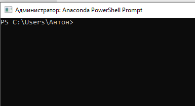

7. Перейдите в командном интерпретаторе в директорию с проектом
8. Создайте виртуальное окружение Python с версией Python 3.10. > conda create -n tplab1-env python=3.10

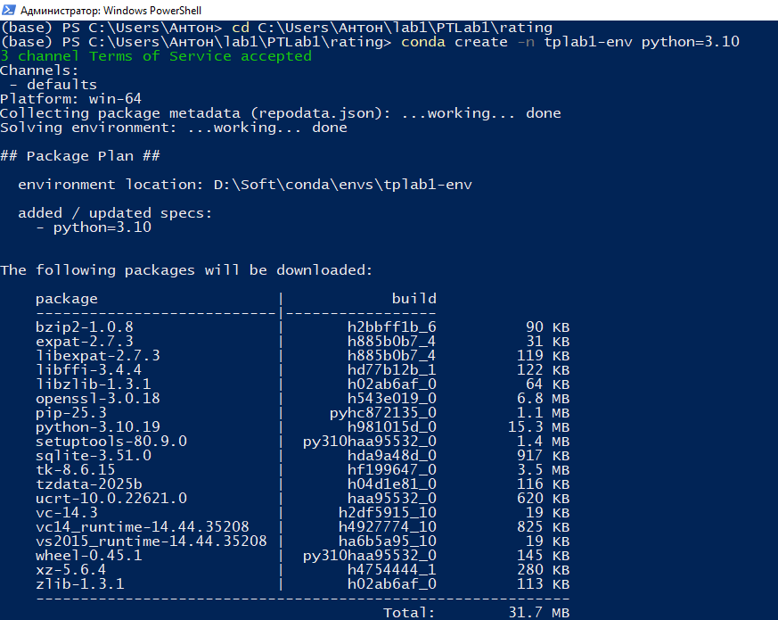

9. Убедитесь в успешной установке окружения. Активируйте созданное окружение командой: > conda activate tplab1-env

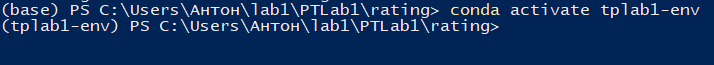

10. Установите в созданном виртуальном окружении необходимые пакеты: > pip install –r requirements.txt

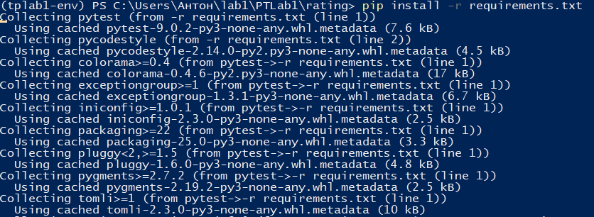

11. Проверьте соответствие программного кода стандарту PEP8. Если при копировании содержимого файлов нарушилось оформление, то может наблюдаться несоответствие проекта стандарту. В этом случае, возникшие ошибки необходимо исправить, руководствуясь их описанием. > pycodestyle.exe src test

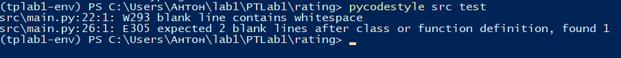

12. Для корректного определения путей к исходным файлам установите переменную окружения PYTHONPATH: > $env:PYTHONPATH = "./:./src"

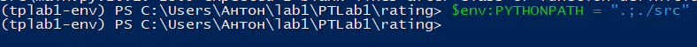

13. Запустите тестирование проекта и проверьте вывод на отсутствие ошибок: > pytest.exe test

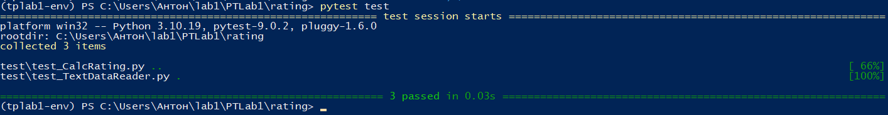

14. Запустите программу и проверьте ее работоспособность: > python.exe .\src\main.py –p .\data\data.txt

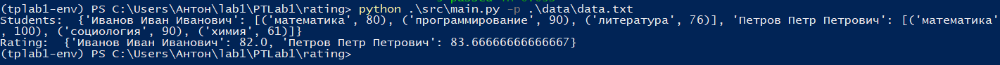

15. Зайдите на сайт https://github.com под своей учетной записью.
16. После регистрации cоздайте новый репозиторий, нажав на кнопку «Create repository».
17. Укажите параметры создаваемого репозитория.

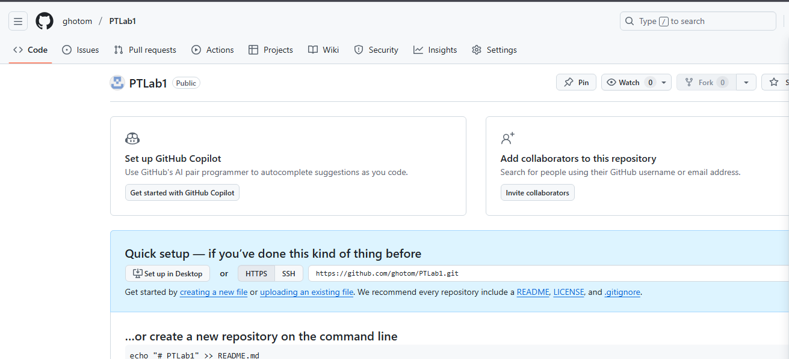

18. Для дальнейшей работы с созданным репозиторием с помощью клиента необходимо получить токен авторизации.
19. В открывшемся окне в категории «Account settings» нужно выбрать «Developer Settings», а затем – «Personal access tokens».
20. Создайте токен, нажав на кнопку «Generate token» внизу страницы.

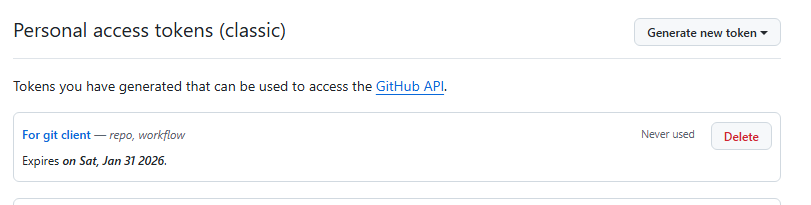

21. Скопируйте и сохраните сгенерированный токен, чтобы он был доступен только Вам!
22. Теперь необходимо настроить консольный клиент Git на компьютере с проектом rating. Запустите консольный клиент Git CMD и зайдите в директорию с проектом: > cd C:\Users\...\rating
23. Создайте новый локальный репозиторий в папке с проектом: > git init После выполнения этой команды в директории должна появиться папка .git.
24. Сконфигурируйте имя пользователя и почтовый адрес клиента Git: > git config --global user.email Ivanov@example.com > git config --global user.name "Ivanov Ivan Ivanovich"

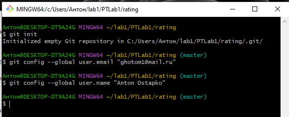

25. Проиндексируйте все файлы и папки, содержащиеся в директории rating: > git add all

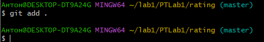

26. Проверьте статус репозитория: > git status

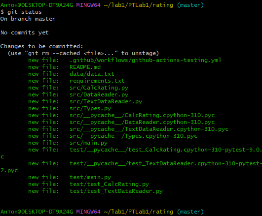

27. Зафиксируйте вновь добавленные файлы в локальной части распределенной системы контроля версий Git, указав комментарий (желательно, осмысленный). Проверьте новый статус репозитория. > git commit –m "My first commit" > git status

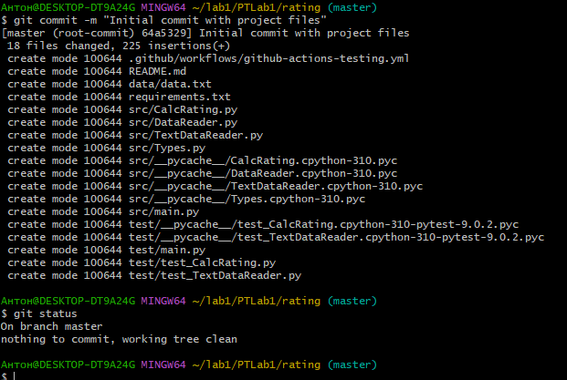

28. Переименуйте основную ветку проекта в main. Вновь проверьте статус репозитория. > git branch –M main > git status

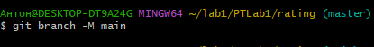

29. Укажите клиенту Git путь к удаленному репозиторию с псевдонимом origin: > git remote add origin https://github.com/<username>/PTLab1.git

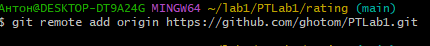

30. Передайте изменения в локальной части репозитория в его серверную часть: > git push –u origin main 

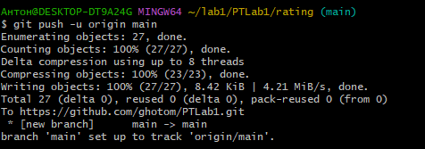

31. Откройте сайт https://github.com и проверьте наличие проекта в глобальном репозитории.

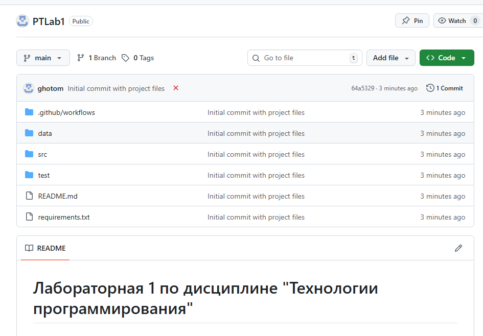

32. Обновите страницу удаленного репозитория GitHub. Если автоматизированное тестирование с помощью GitHub Actions началось, в заголовке проекта будет наблюдаться желтая точка. После окончания тестирования она сменится или зеленой галочкой, показывающей успешное прохождение тестов (см. рисунок 10), или красным крестиком, символизирующим неудачу.  

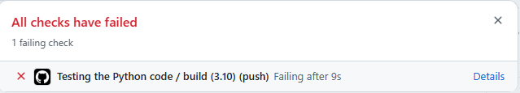

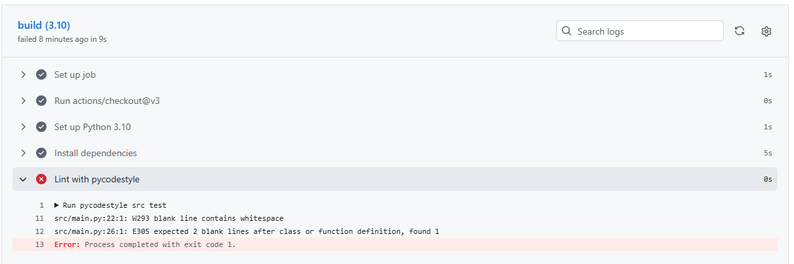

33. Добавьте ошибку в тексты исходных кодов, зафиксируйте изменения в Git и дождитесь отрицательного результата автоматизированного тестирования. Ознакомьтесь с выводом скрипта тестирования и иконкой статуса. Удалите ошибку и вновь зафиксируйте изменения. Убедитесь в успешном прохождении тестирования проекта.

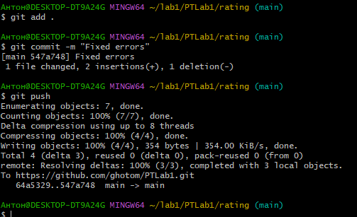

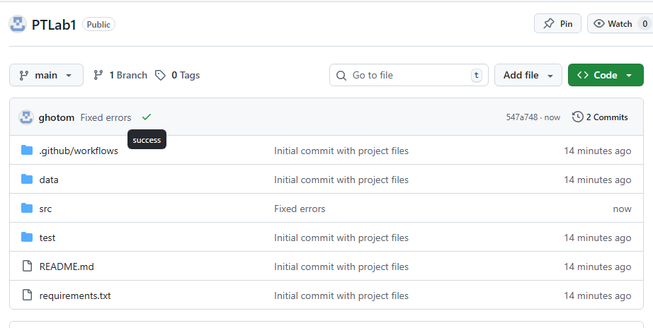
 
# Индивидуальное задание
1. Выберите для Вашего проекта тип лицензии и добавьте файл с лицензией в проект.

 

 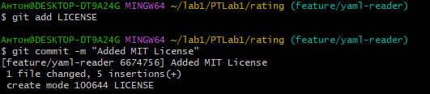

2. Добавьте в проект файл .gitignore и сформируйте его содержимое.

 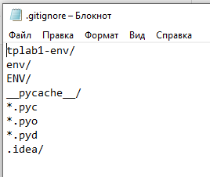

 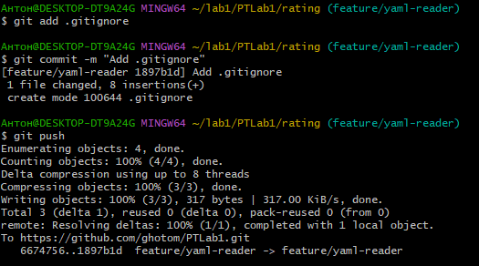

3. Добавьте в проект еще один класс – наследник класса DataReader, который должен обрабатывать входной файл определенного формата (согласно индивидуальному варианту, см. таблицу). Составьте модульные тесты для методов этого класса, постарайтесь покрыть тестами максимально возможный объем кода. Для работы с этим заданием создайте новую ветку кода на основе главной и фиксируйте в нее весь программный код в процессе разработки. Добейтесь выполнения всех тестов проекта, после чего объедините текущую ветку кода с главной.

 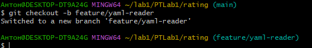

 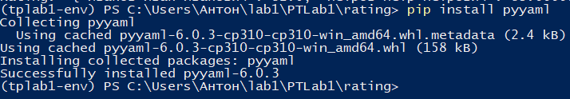

 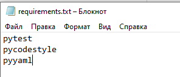

 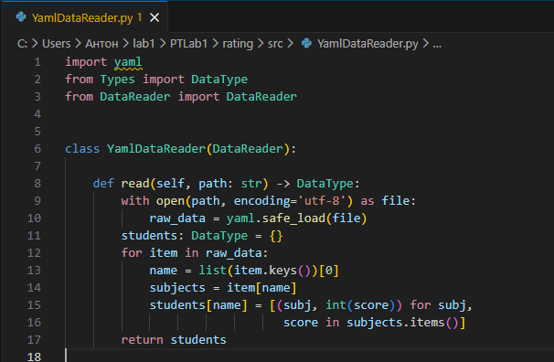

Тест:

 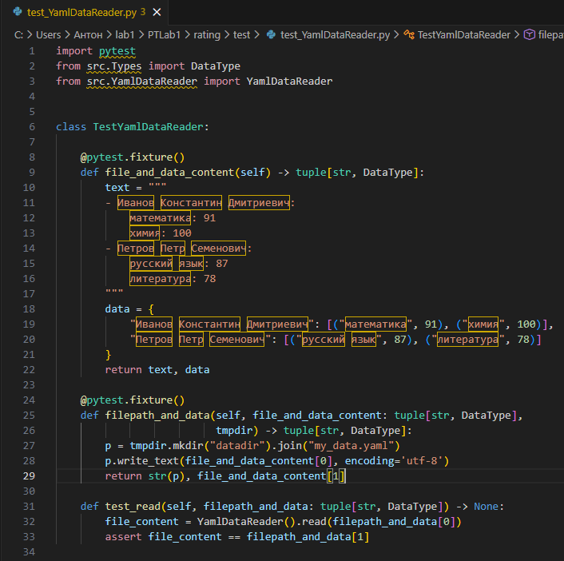

 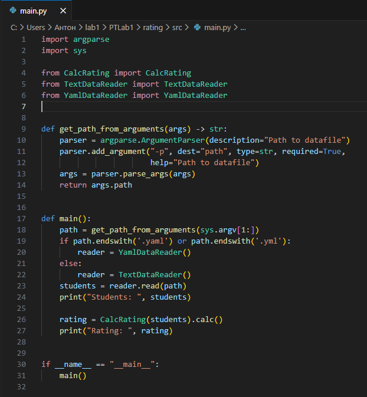

 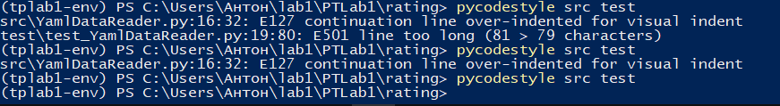

 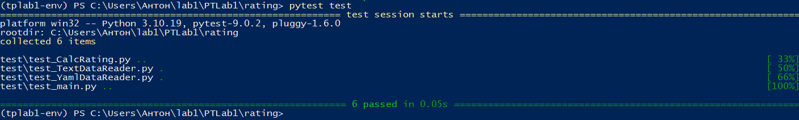

 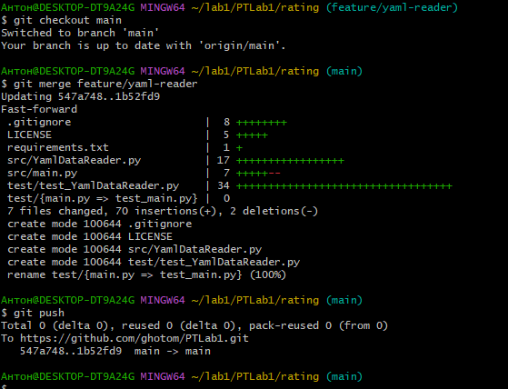

 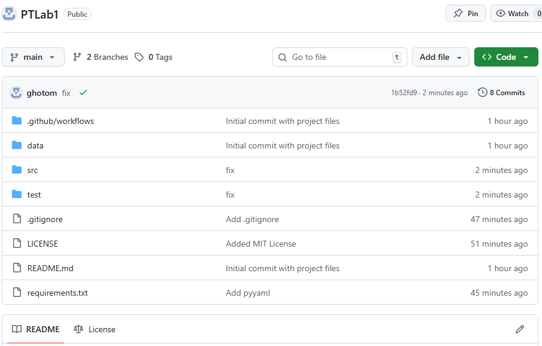

4. Добавьте в проект класс, реализующий расчет определенных характеристик студентов (согласно индивидуальному варианту, см. таблицу). Составьте модульные тесты для методов этого класса, постарайтесь покрыть тестами максимально возможный объем кода. Для работы с этим заданием создайте новую ветку кода на основе главной и фиксируйте в нее весь программный код в процессе разработки. Добейтесь выполнения всех тестов проекта, после чего объедините текущую ветку кода с главной.

 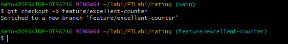

 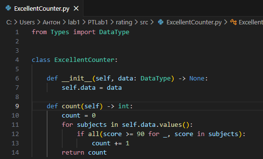

Тест:

 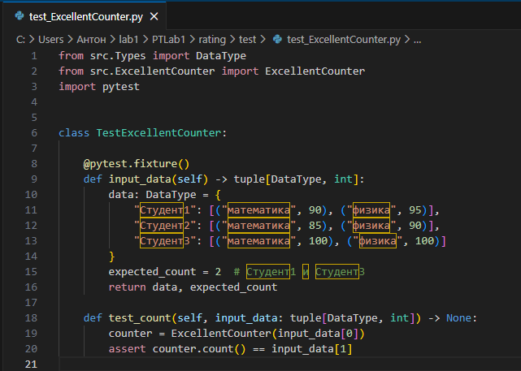

 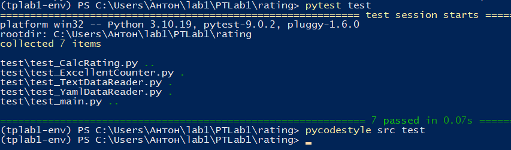

 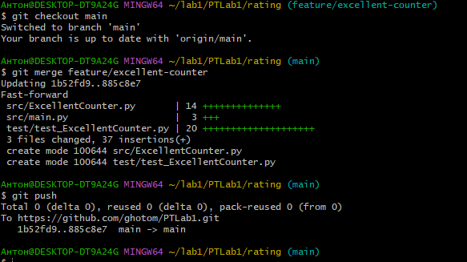

 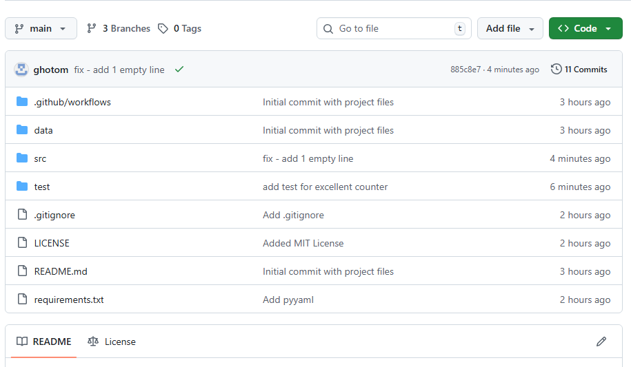

5. Составьте UML-диаграмму классов итогового проекта.

 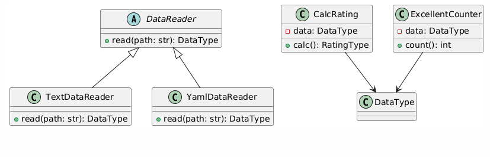

6. Проанализируйте полученные результаты и сделайте выводы.
Файл data.yaml:

 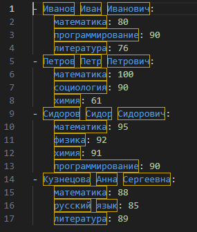
 
 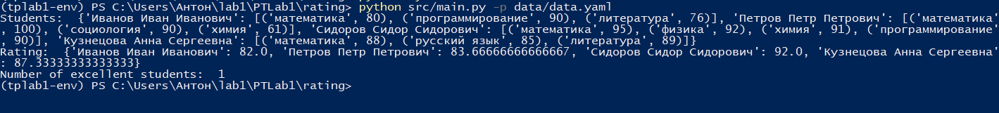
 
## Выводы
Освоены основы Git, ветвление, GitHub Actions. Реализована поддержка нового формата данных и дополнительная аналитика. CI/CD автоматически проверяет код при push — это сильно упрощает разработку.